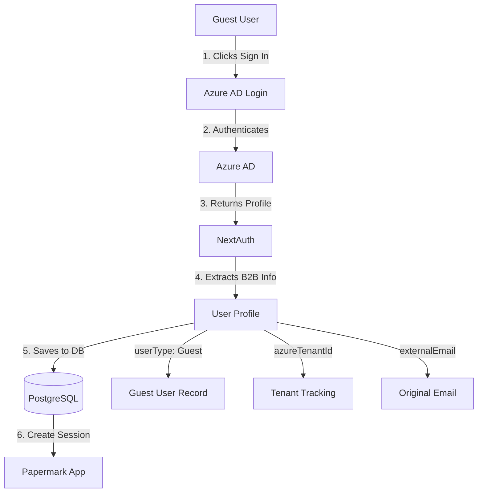

# Deploying Papermark to Azure with B2B Guest Support

This guide will walk you through deploying Papermark to Azure with full Azure AD B2B guest user support.

## Table of Contents

1. [Prerequisites](#prerequisites)
2. [Azure AD B2B Setup](#azure-ad-b2b-setup)
3. [Infrastructure Deployment](#infrastructure-deployment)
4. [Application Configuration](#application-configuration)
5. [Database Migration](#database-migration)
6. [CI/CD Setup](#cicd-setup)
7. [Troubleshooting](#troubleshooting)

## Prerequisites

- Azure subscription with appropriate permissions
- Azure CLI installed ([Install Guide](https://docs.microsoft.com/en-us/cli/azure/install-azure-cli))
- Node.js 18+ installed
- Git

## Azure AD B2B Setup

### 1. Register an Azure AD Application

1. Go to [Azure Portal](https://portal.azure.com)
2. Navigate to **Azure Active Directory** > **App registrations**
3. Click **New registration**
4. Fill in the details:
   - **Name**: Papermark
   - **Supported account types**: Select "Accounts in any organizational directory (Any Azure AD directory - Multitenant)" for B2B support
   - **Redirect URI**: Add `https://your-app-name.azurewebsites.net/api/auth/callback/azure-ad`
5. Click **Register**

### 2. Configure Application Settings

1. After registration, note down:
   - **Application (client) ID** → This is your `AZURE_AD_CLIENT_ID`
   - **Directory (tenant) ID** → This is your `AZURE_AD_TENANT_ID` (or use "common" for multi-tenant)

2. Go to **Certificates & secrets**
   - Click **New client secret**
   - Add a description and expiration
   - Copy the **Value** → This is your `AZURE_AD_CLIENT_SECRET`

3. Go to **API permissions**
   - Add the following Microsoft Graph permissions:
     - `User.Read` (Delegated)
     - `User.ReadBasic.All` (Delegated) - for reading guest user info
     - `Directory.Read.All` (Delegated) - optional, for reading group memberships
   - Click **Grant admin consent** (requires admin)

### 3. Configure B2B Guest Access

1. Navigate to **Azure Active Directory** > **External Identities** > **External collaboration settings**
2. Configure guest user access (recommended settings):
   - **Guest user access**: Guest users have limited access to properties and memberships of directory objects
   - **Guest invite settings**: Anyone in the organization can invite guest users including guests and non-admins
   - **Collaboration restrictions**: Allow invitations to any domain

### 4. Add Redirect URIs

Add the following redirect URIs to your Azure AD app:
- Development: `http://localhost:3000/api/auth/callback/azure-ad`
- Production: `https://your-domain.com/api/auth/callback/azure-ad`
- Azure: `https://your-app-name.azurewebsites.net/api/auth/callback/azure-ad`

## Infrastructure Deployment

### Option 1: Automated Deployment (Recommended)

1. Navigate to the `azure` directory:
   ```bash
   cd azure
   ```

2. Update `parameters.json` with your values:
   ```json
   {
     "appName": { "value": "your-app-name" },
     "environment": { "value": "prod" },
     "azureAdClientId": { "value": "your-client-id" },
     "azureAdTenantId": { "value": "common" }
   }
   ```

3. Make the deployment script executable:
   ```bash
   chmod +x deploy.sh
   ```

4. Run the deployment:
   ```bash
   ./deploy.sh
   ```

### Option 2: Manual Deployment

```bash
# Login to Azure
az login

# Create resource group
az group create --name papermark-rg --location eastus

# Deploy infrastructure
az deployment group create \
  --name papermark-deployment \
  --resource-group papermark-rg \
  --template-file main.bicep \
  --parameters parameters.json
```

## Application Configuration

### Environment Variables

The Bicep template automatically configures most environment variables. Additional variables you may need to set:

```bash
# Set additional environment variables
az webapp config appsettings set \
  --name your-app-name \
  --resource-group papermark-rg \
  --settings \
    GOOGLE_CLIENT_ID=your-google-client-id \
    GOOGLE_CLIENT_SECRET=your-google-client-secret \
    TINYBIRD_TOKEN=your-tinybird-token \
    STRIPE_SECRET_KEY=your-stripe-key
```

### Storage Configuration

The deployment uses **Managed Identity** for secure, passwordless access to Azure Blob Storage. No additional configuration needed.

If you prefer to use account keys:
1. Set `AZURE_USE_MANAGED_IDENTITY=false`
2. Add `AZURE_STORAGE_ACCOUNT_KEY` to app settings

## Database Migration

After infrastructure deployment, run database migrations:

### Option 1: Using Azure CLI

```bash
# SSH into the web app
az webapp ssh --name your-app-name --resource-group papermark-rg

# Run migrations
cd /home/site/wwwroot
npx prisma migrate deploy
```

### Option 2: Using Local Connection

```bash
# Get the database connection string
az postgres flexible-server show-connection-string \
  --server-name your-db-name \
  --database-name papermark \
  --admin-user your-admin-user

# Run migrations locally
export DATABASE_URL="connection-string-from-above"
npx prisma migrate deploy
```

## CI/CD Setup

### GitHub Actions

1. Create the following secrets in your GitHub repository:
   - `AZURE_CREDENTIALS`: Service principal credentials
   - `AZURE_WEBAPP_NAME`: Your web app name
   - `AZURE_RESOURCE_GROUP`: Your resource group name
   - `AZURE_SUBSCRIPTION_ID`: Your Azure subscription ID
   - `NEXTAUTH_SECRET`: Generated secret for NextAuth
   - `NEXTAUTH_URL`: Your production URL
   - `DATABASE_URL`: Your PostgreSQL connection string

2. To get `AZURE_CREDENTIALS`:
   ```bash
   az ad sp create-for-rbac \
     --name "papermark-github-actions" \
     --role contributor \
     --scopes /subscriptions/{subscription-id}/resourceGroups/papermark-rg \
     --sdk-auth
   ```

3. The workflow in `.github/workflows/azure-deploy.yml` will automatically deploy on pushes to main branch.

## Using Azure B2B with Papermark

### Inviting Guest Users

1. **Via Azure Portal**:
   - Navigate to Azure AD > Users > New guest user
   - Add email and send invitation
   - Guest user will receive email with invitation link

2. **Via Papermark**:
   - When a user signs in with Azure AD, their account type (Member/Guest) is automatically detected
   - Guest users are tagged with `userType: "Guest"` in the database
   - Original email is preserved in `externalEmail` field

### Team Integration

Teams can be linked to Azure AD:
- Set `azureTenantId` on a Team to restrict membership to specific Azure AD tenant
- Set `azureGroupId` to auto-sync team membership with an Azure AD group

### Guest User Workflow



### Monitoring B2B Users

Query guest users in your database:

```sql
-- Find all guest users
SELECT id, email, externalEmail, azureTenantId, createdAt
FROM "User"
WHERE "userType" = 'Guest';

-- Find teams with Azure integration
SELECT id, name, azureTenantId, azureGroupId
FROM "Team"
WHERE azureTenantId IS NOT NULL;
```

## Storage: Azure Blob vs AWS S3

The application supports both Azure Blob Storage and AWS S3. Choose based on your needs:

### Use Azure Blob Storage when:
- Deploying to Azure App Service
- Using Managed Identity for authentication
- Leveraging Azure CDN
- Cost optimization with Azure committed use

### Use AWS S3 when:
- Already using AWS infrastructure
- Need specific S3 features (like S3 Select)
- Multi-cloud strategy

### Switching Storage Backends

Set in environment variables:
```bash
# For Azure Blob Storage
STORAGE_BACKEND=azure
AZURE_STORAGE_ACCOUNT_NAME=your-account
AZURE_USE_MANAGED_IDENTITY=true

# For AWS S3 (default)
STORAGE_BACKEND=s3
NEXT_PRIVATE_UPLOAD_BUCKET=your-bucket
```

## Troubleshooting

### Issue: "Redirect URI mismatch"

**Solution**: Ensure all redirect URIs are registered in Azure AD app registration. The URL must exactly match (including https://).

### Issue: "Managed Identity cannot access storage"

**Solution**: Verify role assignment:
```bash
az role assignment list \
  --assignee $(az webapp identity show --name your-app-name --resource-group papermark-rg --query principalId -o tsv) \
  --scope /subscriptions/{sub-id}/resourceGroups/papermark-rg/providers/Microsoft.Storage/storageAccounts/your-storage
```

### Issue: "Database connection failed"

**Solution**: Check firewall rules:
```bash
az postgres flexible-server firewall-rule list \
  --resource-group papermark-rg \
  --name your-db-name
```

### Issue: "Guest users cannot sign in"

**Solution**:
1. Check External Identities settings in Azure AD
2. Verify `azureAdTenantId` is set to "common" for multi-tenant
3. Ensure API permissions are granted

### Logs

View application logs:
```bash
# Stream logs
az webapp log tail --name your-app-name --resource-group papermark-rg

# Download logs
az webapp log download --name your-app-name --resource-group papermark-rg
```

## Security Best Practices

1. **Use Managed Identity**: Always prefer managed identity over account keys
2. **Enable SSL**: Configure custom domain with SSL/TLS
3. **Restrict CORS**: Configure CORS rules on Blob Storage to only allow your app domain
4. **Database Security**:
   - Use SSL connections (enabled by default)
   - Restrict firewall rules to only necessary IPs
   - Regular backups enabled
5. **Secrets Management**: Use Azure Key Vault for sensitive configuration (automated in Bicep template)
6. **Monitor**: Enable Application Insights for monitoring and diagnostics

## Cost Optimization

Estimated monthly costs for production workload:
- App Service Plan (B2): ~$55/month
- PostgreSQL (Standard_B2s): ~$40/month
- Azure Blob Storage: ~$5-20/month (depending on usage)
- Redis Cache (Basic C0): ~$16/month
- **Total**: ~$116-131/month

Cost-saving tips:
- Use reserved instances for 40% savings
- Scale down during off-peak hours
- Use lifecycle management for blob storage
- Consider Azure Database for PostgreSQL - Single Server for lower costs in dev

## Support

For issues specific to Azure deployment, please open an issue with the `azure` label in the repository.

For Azure AD B2B questions, refer to [Microsoft's B2B documentation](https://docs.microsoft.com/en-us/azure/active-directory/external-identities/what-is-b2b).
